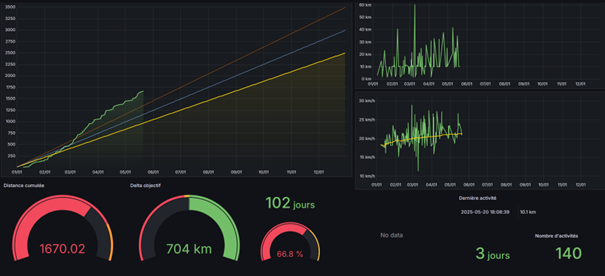

# 🚴 Strava Tracker Dashboard

**This project was initially developed to support a personal goal of cycling 2,500 km within a year.**  
It provides a **self-hosted solution** for tracking **Strava activity data** without requiring a **premium subscription**.

The system automatically **fetches activities from the Strava API**, **stores them in an InfluxDB** time-series database, and **visualizes the data in Grafana**.  
It is **lightweight**, fully **containerized via Docker**, and designed to be **flexible** and easily **customizable** for any type of **fitness tracking** or **personal goal monitoring**.

<p align="center">

</p>


---

## 🚀 Features

- 🔄 Automatic activity sync from **Strava** (free API)
- 📦 Data stored in **InfluxDB**
- 📊 Visualization via **Grafana**
- ⚙️ Easy installation with **Docker Compose**
- 🕒 Regular updates using a **cron task**
- 🔐 Simple configuration using a `.env` file

---

## 📁 Project Structure

```
├── scripts/
│   └── sync_strava.py
├── docker-compose.yml
├── Dockerfile
├── requirements.txt
├── .env
└── README.md
```
---

## 🧪 Prerequisites

- **Docker** & **Docker Compose** installed
- A **Strava** account with activities
- **Strava API** credentials (Client ID, Client Secret, Refresh Token)
- Terminal access with **crontab** available

---

## ⚙️ Configuration

1. **Create a `.env` file** (you can find an example you just need to rename un the repo) at the root of the project with the following content:

```dotenv
# InfluxDB configuration
INFLUXDB_URL=http://influxdb:8086
INFLUXDB_TOKEN=your-influxdb-token
INFLUXDB_ORG=RPI
INFLUXDB_BUCKET=strava_data
INFLUXDB_DB=strava_data
INFLUXDB_USERNAME=your-influxdb-username
INFLUXDB_PASSWORD=your-influxdb-password
# Strava API credentials
STRAVA_CLIENT_ID=your-strava-client-id
STRAVA_CLIENT_SECRET=your-strava-client-secret
STRAVA_REFRESH_TOKEN=your-strava-refresh-token
```

---

## 🐳 Installation with Docker Compose
1. **Clone the repository**:

```
git clone https://github.com/eliobou/strava-progress-dashboard.git
cd strava-tracker-dashboard
```

:warning: **Don't forget to add your .env file with your configuration before continuing!**
You can do so by renaming the example file and filling your details:
```
mv .env.example .env
nano .env
```

1. **Start the services**:

```
docker compose up -d --build
```
This will start:

- **InfluxDB** (for storage)
- **Grafana** (for dashboards)

3. **Access Grafana**:

- URL: `http://IP_ADDRESS:3000`
- Default login: `admin` / `admin` (you’ll be prompted to change the password)

---

## 📈 Create a Grafana Dashboard
Once inside Grafana:

1. Add ***InfluxDB*** as a data source
2. Enter the connection details :
   - **URL** : `http://influxdb:8086`
   - **Auth** : `Basic auth`
     - **User**: `INFLUXDB_USERNAME (in your .env)`
     - **Password**: `INFLUXDB_TOKEN (in your .env)`
   - **Database** : `influx_data`

3. Use the URL: http://influxdb:8086
4. You can now build your own dashboard or import a predefined example in the `Grafana` folder of this repo

---

## ⏱️ Automate Synchronization with Cron
1. Open your system’s crontab:

```
crontab -e
```
2. Add the following line to run the sync script every 5 minutes (might need to change the directory depending of your setup):

```

*/5 * * * * cd /home/pi/strava-progress-dashboard && docker compose run --rm strava-sync >> /var/log/strava_cron.log 2>&1

```

---

## 🔧 Tips & Commands

- To manually test the sync script:

```
docker compose strava-sync
```
To check logs:

```
docker logs strava-sync
```